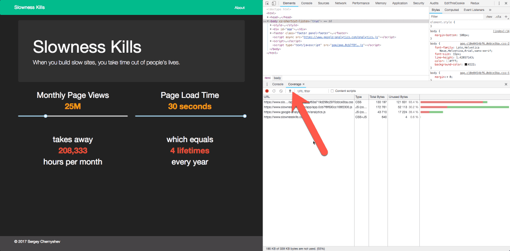
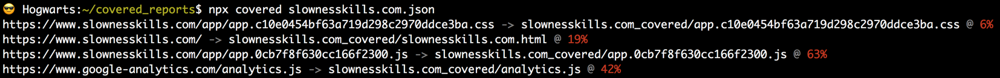

# Covered code extractor for Chrome

Chrome 73 now supports export of [code coverage report](https://developers.google.com/web/updates/2017/04/devtools-release-notes) available since Chrome 59.


## Usage

This npm package allows you to extract portions of the code that were executed during the session.

All you need to do is to save coverage report as JSON file and execute the following command using npx.

```shell
npx covered report.json
```

Command outputs a list of assets and generated covered files as well as percentage of the original file used.


Script generates two folders with all the assets used in the session saved as files.

One folder, `report_original/` will contain original content of the files, served to the browser.

Another, `report_covered/` will contain only code that was actually executed.

## Caveats

Keep in mind that code inside HTML files contains a mix of JavaScript and CSS instructions.

Extracted JavaScript code can not necessarily be used as is (CSS code seems to be good), following issues are known:

- anonymous functions that are not included and passed as arguments to other functions as empty
